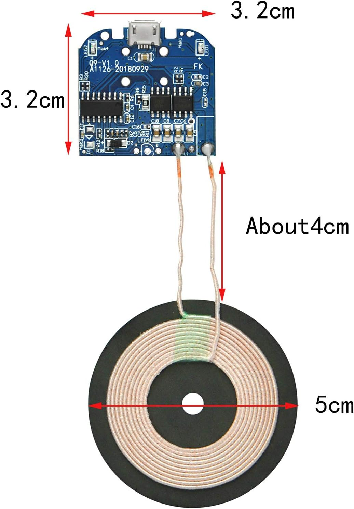
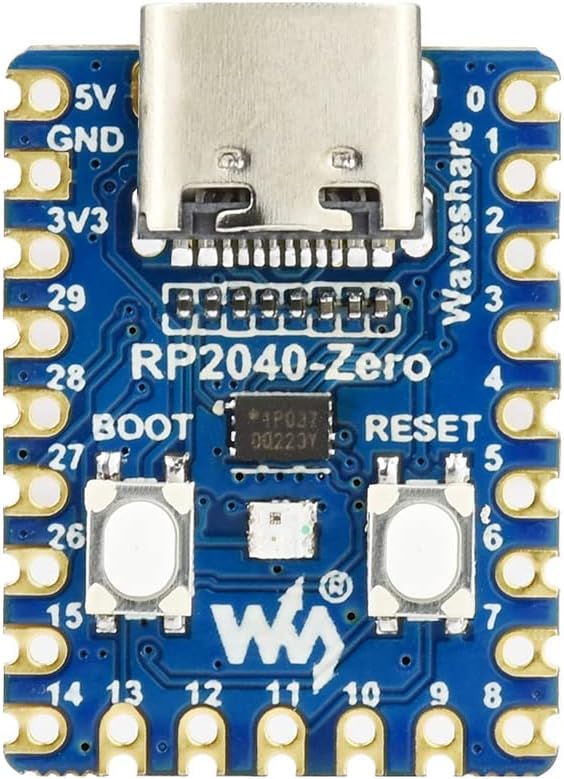
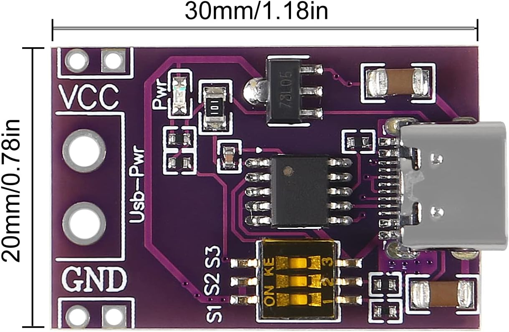
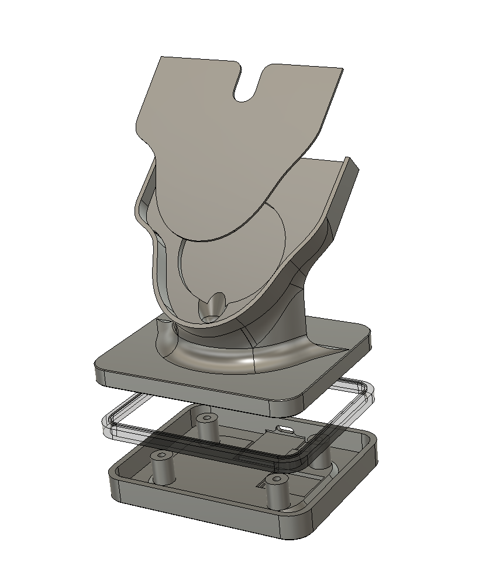
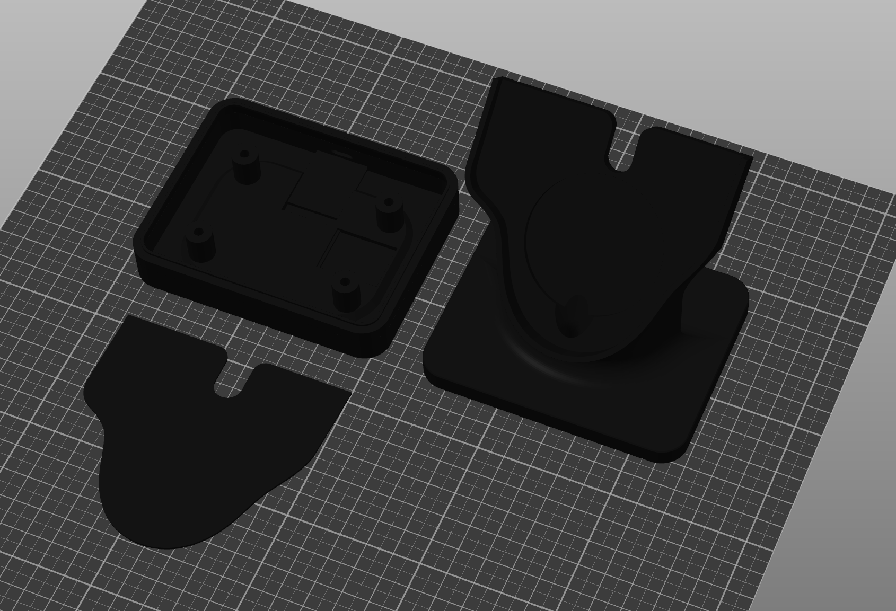
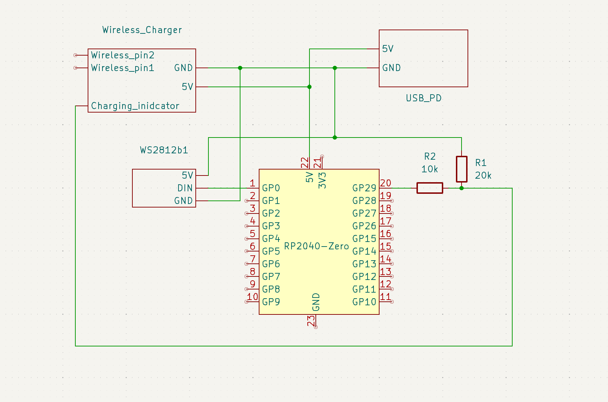
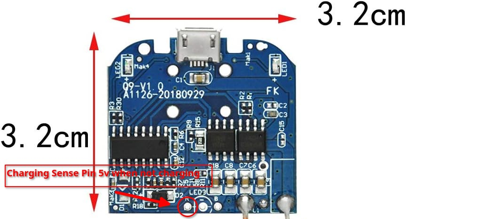

# Corsair Dark Core RGB Pro SE Wireless Charging Stand 
A RGB wireless charging stand for the Corsair Dark Core RGB Pro SE.

[](photos/photo1.jpg)

Designed to be printed with a single manual filament swap for the diffuser ring. 

Printed in Polymaker PolyTerra charcoal matte PLA and SUNLU transparent PLA. 

# Materials

Links are for example purposes and generics should be available from the usual amazon / ebay / Aliexpress.

## Required 
* Generic Wireless charger PCB, there are many listings on amazon and Aliexpress with the same dimensions that will work

  [](https://www.amazon.com/dp/B073W7P5T8?ref=ppx_yo2ov_dt_b_fed_asin_title)

* RP2040-zero

  [](https://www.amazon.com/RP2040-Zero-High-Performance-Microcontroller-Castellated-Applications/dp/B09KZPCNPL?th=1)
  
* USB C Fast Charge Decoy Trigger PCB set at 5V
  
  [](https://www.amazon.com/dp/B0BTHXKM91?ref=ppx_yo2ov_dt_b_fed_asin_title)

* 5v WS2812b RGB strip, 60 LEDs/meter, cut to 18 segments
  
* Wire, heat shrink, soldering equipment
  
* 4x m3x16 self taping screws
* Stick on rubber feet.

Most of the components should be generic enough that the exact seller should not matter, but I have included exactly what I used anyway. Room is tight and most components are sized to fit snugly.

### Optional
* 10k and 20k resistor for voltage divider if you want the RGB to react while charging.
  *  Required if you want the LED on the stand to pulse when the mouse is charging.
* Hot glue
* CA glue
 
# Assembly
[](photos/screenshot_1.png)
## Printing

[](photos/platter.png)

The charging stand is printed in 3 pieces, stand, base, and cover, I used 0.16 layer height. 
Part orientation should be as imported into the slicer. The base and diffuser get imported and sliced together, with a pause and filament swap at ~11.50mm.
Print with supports on for the holder and base. Set your support settings so the only part with supports is the cutout and screw holes. You *may* be able to get away without it depending on how good your printer is at bridging.

 ### Base
The part where the magic happens.
Transparent filament works the best for the diffuser, but a white filament should work. 
Import both the base and the diffuser and slice them together. Insert a pause command or a filament swap at 11.50mm. Be sure to thoroughly purge and clean your nozzle. If your slicer supports it change the settings for the diffuser to be no infill, 2 perimeters, and 0.2 layer height, but feel free to experiment. You are trying to strike a ballance between seeing the individual LEDs and letting light though. This 
will give you the most even defusing.

## Wiring
[](photos/schematic.png)

Wire the PCBs together as shown in the schematic. The LED strip should be 17 or 18 segments long. You will need to locate the 5V and GND input pins on the charging circuit board as well as the charging sense pin. In my case it was high (5v) when not charging and dropped while charging. The charging sense circuit is definitely a hack, but it works. I have included a annotated photo of which pin drops down from 5v when charging, but it should be verified with a multimeter before soldering. Keep extra wirelength to a minimum as space is tight. Be mindful of wire gauges as well, the charging circuit can pull 2A and the LEDs can draw another 1A. You will need to cut and extend the wireless charging pad wires. Use hot glue to secure the PCBs and wires and add extra insolation if needed.

[](photos/screenshot_1.jpg) [](photos/photo4.jpg)

## RP2040 Programing

The the included Arduino code is based on the fastLED DemoReel100 by Mark Kriegsman and is separately licensed under the The MIT License

Program the rp2040 with with included code using your method of choice, I used Arduino IDE. You will need the FastLED library installed. If you are not using the charging sense you can comment out these lines:

```
if (analogRead(chargingSignalPin)<900)
  {
    charging = true;
  }else
  {
    charging = false;
  }
  ```

## Final Assembly
Once everything is wired and tested, you can glue the wireless charge pad and cover with a few drops of CA glue, and secure the base with the 4x screws. You can either cover the holes with the rubber feet or off set them for easier disassembly.
